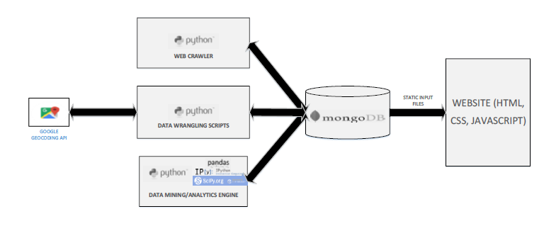

# Aircraft-Crash-Analytics
#### Authors: 
 * Shivam Gaur (shivam6294@gmail.com) (Data Collection, Data Wrangling and Data Mining)
 * Sohail Yar Khan (sohailykhan94@gmail.com) (Web Design,Graphic Design and Web Infrastructure)
#### Website: www.sykdesigns.com/GE2324
Flying is considered as the safest way to travel as of today. But has that always been the case? Was flying as safe in the 20th century? Most of us have boarded an airplane manufactured by Boeing and Airbus, which are two of the biggest and most popular commercial flight manufacturers in the world. How many planes that have been manufactured by them have crashed in the past? What were some of the most common reasons for the crashes? It is questions like these that fueled our curiosity and interest towards this project- Aircraft crash analytics- a visual exploration of aircraft crashes since 1908.

The aviation industry is a mature industry, and is more than a hundred years old. So, there exists a lot of data in this field, especially aircraft crash data. This makes it very interesting, as we were able to grab data that helped us analyse the state of the aircraft safety over a period of an entire century!

Through this project, we have explained in detail, the methodology and tools used for implementing the data pipeline, right from getting the data in HTML format, analyzing it, and to converting it into attractive visualizations can be viewed thorough our website www.sykdesigns.com/GE2324

##  Structure: 
* The project is divided logically into three parts:
  * <u><b> Part 1- Data Collection - Crawling Flight Crash Data.ipynb </u></b>: Scripts to crawl the website www.planecrash.info/database.htm. This can be used as a skeleton to crawl urls that have a pattern.
  * <u><b> Part 2- Data Wrangling- Adding Latitudes and Longitudes using Google Maps Geocoding API.ipynb </u></b>: Adding Geolocation data to the crawled dataset from Part 1, using [Google Maps Geocoding API] (https://developers.google.com/maps/documentation/geocoding/intro)
  * <u><b> Part 3- Aircrash Analytics- Data Mining.ipynb </u></b>: The aim of this IPython Notebook is to perform some exploratory data analysis on the wrangled dataset that we have obtained. We're gonna use Pandas for the most of it, and some SciPy and Scikit Learn towards the end. 

## System Architecture: 

The system architecture of our project is shown in the figure above. The following are the of
the components that were used:
* Data Collection: Python
* Data Storage: MongoDB
* Data Wrangling: Python, Google Geocoding API
* Data Mining: Python (Packages used: Pandas for loading data into memory, IPython
Notebook for interactive analysis, and SciPy for scientific and statistical functions)
* Visualization: HTML, CSS, JavaScript

## Data Mining highlights:

* FATALITIES AND CRASHES BY TIME (YEAR, DECADE, 5 YEAR PERIODS)
Fatalities and crashes per year, fatalities and crashes trends by decade, fatalities and crashes trends by 5-year periods were fairly easy to calculate. They were done by using basic SQL-like group by and sum statements. Please refer to the python code for reference.

* CORRELATION COEFFICIENT SCATTER PLOT AND MATRIX
For this, we used python’s scatter plot matrix, which gave us an idea of which variables were correlated. We found that there was near perfect correlation between the total number fatalities on a plane and the number of passengers(excluding the crew). This visualization can be found on the [website]()

* AIRCRAFT MANUFACTURERS VS TOTAL NUMBER OF CRASHES
For this step, we took only the aircraft type column of the data, cleaned it up (lower casing, removal of numbers, etc.). and grouped it together. We then kept the brand name and discarded the aircraft model number, by using our own algorithm (again, provided in the code that is submitted along with this document). After this, we used an SQL-like COUNT(*) function and got the total air crash count.

* AIRCRAFT CARRIERS VS TOTAL NUMBER OF CRASHES
For this step, our process was similar to the step above, with the exception of using the aircraft carrier column instead of aircraft type column.

* TEXT MINING:
In the dataset, we found that there is a field called summary that contains a small write up about the crash. We thought that we could use this for text mining, and cluster similar air crashes.

First, we performed the following pre processing:
 •  Tokenization
 • Removal of punctuation
 • Stemming (keeping only the stem of the word: fog -> fog, fogginess -> fog, foggy->fog)

Then, we represented each summary as word frequencies and used a TF-IDF representation of features. We will not go into detail about this as it is out of the scope of this course, but we can get an idea from the imager below (each summary was represented using these “tables”).

Once we had these TF-IDF vector representations of each air crash, we could then use a method called cosine similarity, between each pair of crashes. Cosine similarity again, in simplicity, yields number between zero and one. After computing for all, we get a 5300x5300 matrix (as 5300 records had summaries). Since it is a similarity measure, but clustering methods require distance measures, we convert similarity to “dissimilarity” by using the equation below:

Distance measure = 1 – CosineSimilarity(tfidf_matrix)

After this, we created a Ward’s Linkage Matrix, and used that for hierarchical clustering and created a dendrogram. We cut the dendrogram at a distance of 28 by trial and error, as we wanted roughly twenty clusters. The code is also attached [Part 3].

## REQUIREMENTS:
* Ipython Notebook Server (WinPython for Windows/Anaconda for Linux recommended)
* MongoDB server up and running on the same machine (by default. Can link it to the code if it's running elsewhere)
* All the python dependencies must be installed. All the library classes used in this project are available on [PyPI](https://pypi.python.org/pypi) (Python Package Index)
* Google Maps Geocoding API key is required for Part 2
